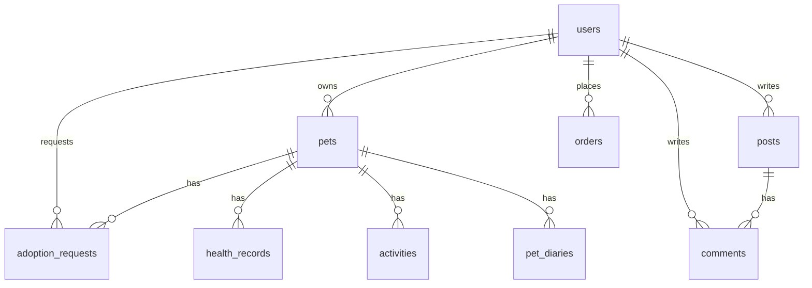

# Pawtopia

> HarmonyOS ArkTS 客户端 + Spring Boot 后端的宠物社区 / 领养 / 档案 / 商城综合平台。

更新时间：2026-03-04  
适用范围：原生鸿蒙 ArkTS 客户端 + Spring Boot 后端（MySQL）

---

## 目录
- [1. 项目概览](#1-项目概览)
- [2. 前端使用说明（用户可见功能）](#2-前端使用说明用户可见功能)
- [3. 技术栈](#3-技术栈)
- [4. 角色与权限](#4-角色与权限)
- [5. 核心模块功能](#5-核心模块功能)
- [6. 客户端页面与路由](#6-客户端页面与路由)
- [7. 关键业务流程](#7-关键业务流程)
- [8. 后端接口清单](#8-后端接口清单)
- [9. 数据库设计](#9-数据库设计)
- [10. 从 0 部署攻略](#10-从-0-部署攻略)
- [11. 开发建议与已知说明](#11-开发建议与已知说明)

---

## 1. 项目概览
Pawtopia 是面向宠物场景的综合平台，覆盖 **社区交流、领养服务、医疗健康、宠物商城** 四大核心模块，并提供多角色身份体系（用户 / 宠物店 / 宠物医院 / 商品卖家 / 管理员）。

客户端支持离线占位数据展示，并在后端不可用时提示，同时保证主要页面结构可浏览。

---

## 2. 前端使用说明（用户可见功能）

### 底部主导航
应用底部包含 5 个主入口：
- 社区
- 领养
- 档案
- 商城
- 我的

### 登录与注册
- 登录页支持：用户名、密码、服务地址配置
- 注册页支持：用户名、昵称、邮箱、密码、确认密码
- 登录成功后进入主界面

### 社区模块
可见功能：
- 浏览推荐帖子
- 查看我的帖子
- 搜索帖子
- 点赞帖子
- 查看帖子详情
- 评论与回复
- 发布帖子
- 编辑 / 删除自己的帖子

使用方法：
1. 进入“社区”页浏览帖子流
2. 点击分类标签切换内容
3. 点击帖子进入详情
4. 在“我的帖子”中可编辑 / 删除自己发布的内容

### 领养模块
可见功能：
- 查看可领养宠物
- 搜索城市 / 品种 / 宠物名
- 查看我发布的领养宠物
- 查看我申请的领养
- 查看收到的申请
- 提交领养申请

使用方法：
1. 在“领养”页浏览宠物卡片
2. 进入详情页填写联系人、电话和申请说明
3. 提交后可在“我的领养申请”中查看进度

### 宠物档案模块
可见功能：
- 添加宠物
- 查看宠物档案
- 查看健康记录
- 医院授权
- 进入宠物详情

使用方法：
1. 在“档案”页添加宠物
2. 点击宠物卡片进入详情
3. 可继续查看健康档案或授权医院

### 商城模块
可见功能：
- 浏览商品列表
- 搜索商品
- 按分类筛选商品
- 查看商品详情
- 加入购物车
- 进入购物车

当前商品分类：
- 全部
- 主粮零食
- 玩具互动
- 宠物服饰
- 护理用品
- 健康护理

使用方法：
1. 进入“商城”页浏览商品
2. 点击顶部分类切换筛选
3. 点击商品卡片进入详情
4. 点击商品右下角“+”加入购物车
5. 点击右上角购物车图标进入购物车

### 购物车
可见功能：
- 查看已加入商品
- 修改数量
- 删除商品
- 查看总金额
- 填写收货信息
- 提交订单

使用方法：
1. 点击加减号调整数量
2. 点击 × 删除商品
3. 填写收货地址、联系人、手机号
4. 点击“去结算”提交订单

### 我的页面
可见功能：
- 查看个人资料
- 查看帖子 / 宠物 / 订单 / 领养统计
- 进入资料设置
- 查看订单
- 查看领养申请
- 清空购物车缓存
- 退出登录

### 管理员在“我的”页新增入口
管理员角色可见以下管理功能：
- 用户管理
- 内容巡检
- 商品管理
- 宠物档案管理
- 领养信息管理
- 系统订单

#### 商品管理
管理员 / 卖家可：
- 新增商品
- 编辑商品
- 删除商品
- 设置商品名称、描述、价格、库存
- 设置分类标签
- 手动选择商品图片

#### 宠物档案管理
管理员可：
- 查看所有宠物档案
- 编辑宠物名称、物种、品种、年龄、性别、描述
- 手动切换宠物图片

#### 领养信息管理
管理员可：
- 修改领养城市
- 修改领养要求
- 修改领养状态（可领养 / 暂停 / 已领养）
- 维护公开领养内容

---

## 2. 技术栈
- **客户端**：HarmonyOS ArkTS + ArkUI
- **后端**：Spring Boot 3.x + Spring Security + JWT
- **数据库**：MySQL 8.x
- **构建**：Maven

---

## 3. 角色与权限
**系统角色枚举（后端 `User.Role`）**
- `USER` 普通用户
- `ADMIN` 管理员（默认后门账户）
- `PET_SHOP` 宠物店
- `PET_HOSPITAL` 宠物医院
- `SELLER` 商品卖家

**权限策略（服务端）**
- `GET` 的多数公共数据允许匿名访问：
  - `/api/posts/**`
  - `/api/comments/**`
  - `/api/products/**`
  - `/api/pets/**`
  - `/api/adoptions/listings`
- 其余操作必须携带 `Authorization: Bearer <JWT>`
- 业务内再做细粒度校验（如：只有宠物 owner / ADMIN 可以查看领养申请）

**默认管理员账户**
- 用户名：`user1`
- 密码：`user1`
- 通过种子数据自动生成（可在 `application.properties` 中关闭）

---

## 4. 核心模块功能
### 4.1 社区模块
- 帖子列表（分页）
- 帖子详情
- 评论与回复
- 点赞
- 发帖（登录后）

### 4.2 领养模块
- 领养列表（匿名可浏览）
- 领养详情 + 申请表单
- 申请列表（宠物 owner / ADMIN）
- 我的领养申请
- 申请撤回
- 申请审核（同意 / 拒绝）

### 4.3 医疗模块
- 宠物健康档案（疫苗 / 体检 / 治疗）
- 记录新增 / 查询
- 适配宠物医院角色访问

### 4.4 商城模块
- 商品列表与检索
- 商品详情
- 购物车
- 订单列表 / 创建

### 4.5 我的模块
- 账号信息与角色显示
- 资料编辑
- 订单入口
- 领养申请入口
- 后端地址配置
- 退出登录

---

## 5. 客户端页面与路由
**入口与鉴权**
- `pages/Index`：启动页，自动登录 `user1`，失败进入离线展示并提示
- `pages/Login`：登录页（角色选择展示中文，仅用于提示；登录时按账号识别角色）
- `pages/Register`：注册页（必须选择角色）

**主功能页**
- `pages/MainTabs`：Tab 容器
- `tabs/CommunityTab`：社区
- `tabs/AdoptTab`：领养
- `tabs/MedicalTab`：医疗
- `tabs/MallTab`：商城
- `tabs/MeTab`：我的

**详情与子页面**
- `pages/PostDetail`
- `pages/NewPost`
- `pages/PetDetail`
- `pages/NewPet`
- `pages/HealthRecords`
- `pages/NewHealthRecord`
- `pages/AdoptionRequests`（宠物 owner 查看）
- `pages/MyAdoptions`（申请者）
- `pages/ProductDetail`
- `pages/Cart`
- `pages/Orders`

---

## 6. 关键业务流程
### 6.1 启动与自动登录
- App 启动后调用 `Index` 页面自动登录 `user1/user1`
- 后端可连通：直接进入主页面
- 后端不可连通：显示 Toast，并进入主页面（使用离线占位数据）

### 6.2 登录与注册
- 登录：只需用户名+密码（角色由后端账号类型决定）
- 注册：必须选择角色（中文）
- 登录成功后存储 JWT 与用户信息

### 6.3 离线模式
- 后端不可用时：
  - 页面继续显示
  - 数据来自 `MockData`
  - 用户在“我的”页可重新配置服务地址并登录

### 6.4 领养流程
1. 用户在领养列表查看宠物
2. 进入详情并提交申请（填写留言、联系人、电话）
3. 申请者可在“我的领养申请”撤回
4. 宠物 owner / 管理员在申请列表中审核（同意/拒绝）

### 6.5 订单流程
1. 商品列表 → 商品详情 → 加入购物车
2. 购物车提交订单（需要登录）
3. 查看订单列表

---

## 7. 后端接口清单（按模块）
> 说明：除匿名接口外，其余均需 `Authorization: Bearer <JWT>`

### 7.1 鉴权
- `POST /api/auth/login`  
  请求：`{ username, password }`  
  响应：`{ token, user }`
- `POST /api/auth/register`  
  请求：`{ username, password, email, nickname, role }`  
  响应：`{ token, user }`

### 7.2 用户
- `GET /api/users`
- `GET /api/users/{id}`
- `GET /api/users/username/{username}`
- `POST /api/users`
- `PUT /api/users/{id}`
- `DELETE /api/users/{id}`

### 7.3 宠物
- `GET /api/pets`（匿名）
- `GET /api/pets/{id}`（匿名）
- `GET /api/pets/owner/{ownerId}`（本人或管理员）
- `GET /api/pets/species/{species}`
- `GET /api/pets/owner/{ownerId}/species/{species}`
- `POST /api/pets`
- `PUT /api/pets/{id}`
- `DELETE /api/pets/{id}`

### 7.4 领养
- `GET /api/adoptions/listings`（匿名）
- `POST /api/adoptions/pets/{petId}/requests`
- `GET /api/adoptions/pets/{petId}/requests`（owner/ADMIN）
- `GET /api/adoptions/requests/mine`
- `PUT /api/adoptions/requests/{id}/status/{status}`
- `PUT /api/adoptions/requests/{id}/cancel`（申请者撤回）

### 7.5 社区帖子
- `GET /api/posts`（分页，匿名）
- `GET /api/posts/{id}`（匿名）
- `GET /api/posts/user/{userId}`（本人或管理员）
- `GET /api/posts/user/{userId}/all`（本人或管理员）
- `GET /api/posts/pet/{petId}`
- `POST /api/posts`
- `PUT /api/posts/{id}`
- `DELETE /api/posts/{id}`
- `POST /api/posts/{id}/like`
- `DELETE /api/posts/{id}/like`

### 7.6 评论
- `GET /api/comments/post/{postId}`（分页，匿名）
- `GET /api/comments/post/{postId}/top`
- `GET /api/comments/parent/{parentId}`
- `GET /api/comments/user/{userId}`（本人或管理员）
- `GET /api/comments/{id}`
- `POST /api/comments`
- `PUT /api/comments/{id}`
- `DELETE /api/comments/{id}`
- `POST /api/comments/{id}/like`
- `DELETE /api/comments/{id}/like`

### 7.7 商品与商城
- `GET /api/products`（分页，匿名）
- `GET /api/products/{id}`（匿名）
- `GET /api/products/category/{category}`
- `GET /api/products/search?name=...`
- `GET /api/products/category/{category}/price/asc`
- `GET /api/products/category/{category}/price/desc`
- `POST /api/products`
- `PUT /api/products/{id}`
- `DELETE /api/products/{id}`

### 7.8 订单
- `GET /api/orders/user/{userId}`（本人或管理员）
- `GET /api/orders/status/{status}`（管理员）
- `GET /api/orders/user/{userId}/status/{status}`
- `GET /api/orders/{id}`
- `POST /api/orders`
- `PUT /api/orders/{id}`
- `PATCH /api/orders/{id}/status/{status}`
- `PUT /api/orders/{id}/status/{status}`（兼容客户端）
- `DELETE /api/orders/{id}`

### 7.9 医疗健康
- `GET /api/health-records/pet/{petId}`（owner/医院/ADMIN）
- `GET /api/health-records/pet/{petId}/type/{recordType}`
- `GET /api/health-records/pet/{petId}/date-range`
- `GET /api/health-records/date-range`
- `GET /api/health-records/upcoming-appointments`
- `GET /api/health-records/{id}`
- `POST /api/health-records`
- `PUT /api/health-records/{id}`
- `DELETE /api/health-records/{id}`

### 7.10 活动 / 日记
- `GET /api/activities/pet/{petId}`
- `GET /api/activities/user/{userId}`
- `GET /api/activities/pet/{petId}/date-range`
- `GET /api/activities/user/{userId}/date-range`
- `GET /api/activities/date-range`
- `GET /api/activities/{id}`
- `POST /api/activities`
- `PUT /api/activities/{id}`
- `DELETE /api/activities/{id}`

- `GET /api/pet-diaries/pet/{petId}`
- `GET /api/pet-diaries/user/{userId}`
- `GET /api/pet-diaries/pet/{petId}/date-range`
- `GET /api/pet-diaries/user/{userId}/date-range`
- `GET /api/pet-diaries/{id}`
- `POST /api/pet-diaries`
- `PUT /api/pet-diaries/{id}`
- `DELETE /api/pet-diaries/{id}`

---

## 9. 管理后台与媒体存储

### 9.1 管理后台入口
- 网页后台入口：`/admin`
- 形态：Spring Boot 内嵌静态管理后台（`PawtopiaBackend/src/main/resources/static/admin`）
- 交互：左侧菜单、顶部栏、表格、表单、删除确认，覆盖商品、宠物、领养和媒体资源管理

### 9.2 后台接口
- `GET /api/admin/products`
- `GET /api/admin/products/{id}`
- `POST /api/admin/products`
- `PUT /api/admin/products/{id}`
- `DELETE /api/admin/products/{id}`
- `GET /api/admin/pets`
- `GET /api/admin/pets/{id}`
- `POST /api/admin/pets`
- `PUT /api/admin/pets/{id}`
- `DELETE /api/admin/pets/{id}`
- `GET /api/admin/adoptions/requests`
- `GET /api/admin/adoptions/requests/{id}`
- `GET /api/admin/adoptions/pets/{petId}/requests`
- `PUT /api/admin/adoptions/requests/{id}/status/{status}`
- `GET /api/admin/media-assets`
- `GET /api/admin/media-assets/{id}`
- `POST /api/admin/media-assets/upload`
- `POST /api/admin/media-assets/fetch`

### 9.3 媒体资源存储
- 业务图片优先使用后端 URL，不再依赖客户端内置资源
- 默认上传目录：`uploads`
- 默认公开访问前缀：`/uploads`
- 本地上传与远程图片抓取后，客户端可直接消费返回 URL

### 9.4 客户端同步策略
- 后台保存后立即写入数据库
- Harmony 客户端在页面进入、返回或关键操作后重新拉取接口
- 当前阶段采用“重拉接口”保证读取数据库最新内容，不依赖 WebSocket

## 10. 数据库设计（核心表）
### 10.1 表清单
- `users`
- `pets`
- `adoption_requests`
- `posts`
- `comments`
- `products`
- `orders`
- `health_records`
- `activities`
- `pet_diaries`

### 8.2 主要字段（摘要）
**users**
- `id` PK
- `username` 唯一
- `password`
- `email`
- `nickname`
- `avatar`
- `age`
- `gender`（MALE/FEMALE/OTHER）
- `phone`
- `role`（USER/ADMIN/PET_SHOP/PET_HOSPITAL/SELLER）
- `created_at`, `updated_at`

**pets**
- `id`
- `name`, `species`, `breed`, `color`, `age`, `gender`, `size`, `description`
- `adoption_status`（AVAILABLE/PAUSED/ADOPTED）
- `adoption_city`, `adoption_note`
- `birth_date`
- `owner_id`
- `created_at`, `updated_at`

**adoption_requests**
- `id`, `pet_id`, `owner_id`, `requester_id`
- `status`（PENDING/APPROVED/REJECTED/CANCELLED）
- `message`, `contact_name`, `contact_phone`
- `created_at`, `updated_at`

**posts**
- `id`, `title`, `content`, `user_id`, `pet_id`
- `image_urls`
- `view_count`, `like_count`, `comment_count`
- `created_at`, `updated_at`

**comments**
- `id`, `post_id`, `user_id`, `parent_id`, `content`, `like_count`
- `created_at`, `updated_at`

**products**
- `id`, `name`, `description`, `price`, `image`, `stock_quantity`
- `category`（FOOD/TOY/CLOTHES/ACCESSORY/MEDICINE/OTHER）
- `created_at`, `updated_at`

**orders**
- `id`, `user_id`, `product_ids`, `quantities`
- `total_amount`
- `status`（PENDING/PAID/SHIPPED/DELIVERED/CANCELLED）
- `shipping_address`, `contact_phone`, `contact_name`
- `created_at`, `updated_at`

**health_records**
- `id`, `pet_id`, `record_type`, `title`, `description`
- `record_date`, `next_due_date`, `veterinarian`
- `created_at`, `updated_at`

**activities**
- `id`, `pet_id`, `user_id`, `title`, `description`
- `type`（WALK/RUN/PLAY/TRAINING/OTHER）
- `activity_date`, `duration`, `calories`
- `created_at`, `updated_at`

**pet_diaries**
- `id`, `pet_id`, `user_id`, `title`, `content`, `image`
- `diary_date`, `created_at`, `updated_at`

### 8.3 ER 图（Mermaid）


---

## 11. 从 0 部署攻略
### 11.1 环境准备
- JDK 17
- Maven 3.9+
- MySQL 8.x
- DevEco Studio（支持 HarmonyOS）

### 9.2 数据库初始化
```sql
CREATE DATABASE pawtopia DEFAULT CHARACTER SET utf8mb4;
```
- 修改 `PawtopiaBackend/src/main/resources/application.properties` 中数据库账号密码
- 如果不需要自动生成示例数据：`app.seed.enabled=false`

### 9.3 启动后端
在 `PawtopiaBackend` 目录执行：
```bash
mvn spring-boot:run
```
默认端口：`http://localhost:8080`

### 11.4 启动客户端
1. 使用 DevEco Studio 打开项目根目录
2. 真机调试时，将“登录页服务端地址”改为局域网 IP，例如：`http://192.168.1.100:8080`
3. 运行到真机或模拟器

### 11.5 权限
客户端已声明：
- `ohos.permission.INTERNET`

---

## 11. 开发建议与已知说明
- 登录页角色选择仅用于提示，实际身份由账号类型决定  
- 领养申请支持撤回  
- 后端采用 JWT 鉴权，客户端自动携带 token  
- 离线时展示 MockData，UI 可完整浏览
- 商城分类、图片与价格显示已经支持扩展模板；若仍看到旧数据，需要重置或重新导入后端种子数据
- 管理员可在“我的”页进入商品管理、宠物档案管理、领养信息管理入口进行人工维护
